# SleepTrace

## 概要
スマートバンドの睡眠計測データを記録・可視化するWebアプリケーションです。
### 解決したい課題
スマートバンド(HUAWEI band 10)のスマホアプリでしか、睡眠データを見ることができず、長期的な振り返りをすることができませんでした。
### 目的
そこで、スマートバンドの睡眠データを記録・可視化するWebアプリを作成し、PCの大きい画面で過去の睡眠データを振り返ることができるようにすることを目的としました。

## 開発期間
2026/01/12～2026/02/11

## デモ
- **フロントエンド**: https://sleeptrace-frontend.pages.dev
- **バックエンド API**: https://sleeptrace-backend.yshimura1001.workers.dev

### ゲストログイン
```
ユーザー名: guest
パスワード: Bc@r1#DMXn
```

## 主な機能
- 睡眠データの登録・編集・削除
- ダッシュボードでの統計情報表示（平均値、トレンド分析）
- 週間データのグラフ表示
- 睡眠分析（トレンドライン付きチャート）
- CSVインポート/エクスポート
- JWT認証によるユーザー管理
- ダークモード対応

## リポジトリ
- **フロントエンド**: https://github.com/yshimura1001/sleeptrace-fontend
- **バックエンド**: https://github.com/yshimura1001/sleeptrace-backend

## 技術スタック
### フロントエンド
| カテゴリ | 技術 | 選定理由 |
|---------|------|---------|
| フレームワーク | Vue.js 3.5 (Composition API) | 開発効率が高いため。 |
| 言語 | TypeScript 5.9 | 型安全性によるバグ防止と開発体験の向上のため。 |
| ビルドツール | Vite 7 | ※標準でプロジェクトに組み込まれているため。 |
| 状態管理 | Pinia | Vue 3公式推奨のため。 |
| ルーティング | Vue Router | Vue.js公式ルーティングライブラリのため。 |
| スタイリング | Tailwind CSS 3.4 | shadcn/uiを利用するため。 |
| UIコンポーネント | shadcn/ui (Radix Vue / Reka UI) | 高品質のUIコンポーネントを利用できるため。 |
| グラフ描画 | Chart.js + vue-chartjs | 軽量で多彩なグラフ描画が可能なため。 |
| ホスティング | Cloudflare Pages | デプロイが容易なサーバレス及びCDN環境のため。|

### バックエンド
| カテゴリ | 技術 | 選定理由 |
|---------|------|---------|
| フレームワーク | Hono 4.11 | 開発効率が高いため。 |
| 言語 | TypeScript 5.9 | フロントエンドと言語を統一し型安全性を確保するため。 |
| バリデーション | Zod | TypeScriptファーストで型推論が強力 |
| 認証 | JWT (hono/jwt) | ステートレスな認証、Honoとの統合が容易なため。 |
| ホスティング | Cloudflare Workers | エッジコンピューティングによるサーバーレス環境のため。|

### データベース
| カテゴリ | 技術 | 選定理由 |
|---------|------|---------|
| ホスティング | Cloudflare D1 (SQLite) | Cloudflare Workersとのネイティブ統合され、簡単に利用できるため。 |

## システム構成図


## ER図


## 工夫点
1. Claude CodeやGeminiといったAIコーディングエージェントを利用して開発するスタイルを採用しつつ、自然言語での指示を少なくするため、様々な指示方法を試した点。
   - データベースのテーブル構造を簡単にファイルにまとめ、そのファイルを参照するよう指示出し。
   - Excelでグラフを作成し、「そのスクリーンショットと同じグラフを再現してください。」という指示出し。
1. ダッシュボード画面にトレンドの表を追加し、それぞれの項目が改善しているのか、悪化しているのかをすぐに確認できるようにした点。
1. 推進データ一覧画面などで、基準の上限以上の場合は赤色に塗りつぶす、反対に下限以下の場合は、青で塗りつぶすことで視覚的に分かりやすくした点。

## 苦労点
1. JavaScriptのライブラリの選択肢が多く、どれを採用すべきか悩んだ点。(最終的にVue.jsを採用することで、意図的に選択肢を少なくしました。)
1. フロントエンドの知識や経験が不足しており、フロントエンドの開発に苦労した点。(状態管理などをさらに学んでいきたいです。)
1. コードが正しいかをその場でチェックできなかったため、コードレビューの時間を設けた点。(Claude Codeにコードを解説・より良いコードにする方法を議論しながらレビューを行いました。)

## 今後の展望
1. ダッシュボードの期間指定フィルタリング機能。
   - 現在は全期間の集計のみのため、「直近1ヶ月」「3ヶ月」「任意の期間」など期間を絞った統計・トレンド分析を可能にする。

1. ORMライブラリ(Drizzleなど)の導入。

1. セキュリティ強化。
   - パスワードハッシュのbcrypt/Argon2への移行。
   - リフレッシュトークンによるセッション管理の改善。
   - 認証エンドポイントへのレートリミット導入。

1. テストの整備。(バックエンドの認証・アクセス制御・ダッシュボード集計ロジック、フロントエンドのフォームバリデーションなど)
    - ユニットテストの追加。
    - 統合テストの追加。

1. レスポンシブデザイン対応。
    - モバイル端末向けのハンバーガーメニュー実装。
    - テーブルの横スクロール対応。
    - 小さい画面/ウィンドウでのチャート表示の最適化。

## ローカル開発環境
| カテゴリ | 技術 |
|---------|------|
| メインOS | Windows 11 Pro |
| サブOS | Ubuntu 24.04.03(WSL)|
| エディタ | VS Code, Antigravity|
| AIコーディングエージェント | Claude(Code), Gemini(AI Pro→Plus)|

### 前提条件
- Node.js 24.13.0
- pnpm

## ローカルでの実行方法

### セットアップ
```bash
# フロントエンド
cd sleeptrace-frontend
pnpm install

# バックエンド
cd sleeptrace-backend
pnpm install
```

### データベースの初期化
```bash
cd sleeptrace-backend

# ローカルD1データベースにテーブルを作成し初期ユーザーを登録
pnpm dlx wrangler d1 execute sleeptrace-db --local --file=schema.sql
```

### 起動（別々のターミナルで実行）
```bash
# ターミナル1: バックエンド（http://localhost:8787）
cd sleeptrace-backend
pnpm run dev

# ターミナル2: フロントエンド（http://localhost:5173）
cd sleeptrace-frontend
pnpm dev
```
